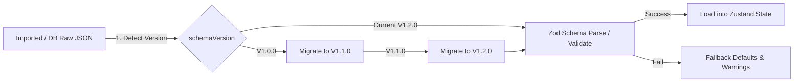

# Architecture & Data Model Review

This document contains the core domain schemas, folder structures, and persistence recommendations for the Template-to-Flyer Generator. It serves as the single source of truth for the subagents implementing the layout engine, state store, database, and export systems.

---

## 1. Domain Model Schemas (TypeScript & Zod)

To ensure compile-time type safety and runtime data validation, the project will use **Zod** for schema parsing. The following schemas define all critical models, including the newly introduced `Asset`, `Template`, and `ExportPackageManifest` objects.

```typescript
import { z } from 'zod';

// ==========================================
// 1. Canvas Preset Schema
// ==========================================
export const CanvasPresetSchema = z.object({
  id: z.string().uuid().or(z.string()),
  name: z.string().min(1, 'Preset name is required'),
  widthPx: z.number().int().positive('Width must be a positive integer'),
  heightPx: z.number().int().positive('Height must be a positive integer'),
  dpi: z.number().int().positive().default(300),
  safeMarginPx: z.number().int().nonnegative().default(120),
  unit: z.enum(['in', 'px', 'mm']).default('in'),
});

export type CanvasPreset = z.infer<typeof CanvasPresetSchema>;

// ==========================================
// 2. Brand Profile Schema
// ==========================================
export const BrandColorsSchema = z.object({
  background: z
    .string()
    .regex(/^#[0-9A-Fa-f]{6}$/, 'Must be a valid hex color (e.g. #FFFFFF)'),
  primary: z.string().regex(/^#[0-9A-Fa-f]{6}$/, 'Must be a valid hex color'),
  secondary: z.string().regex(/^#[0-9A-Fa-f]{6}$/, 'Must be a valid hex color'),
  muted: z.string().regex(/^#[0-9A-Fa-f]{6}$/, 'Must be a valid hex color'),
});

export const FontPreferencesSchema = z.object({
  heading: z.string().default('Inter'),
  body: z.string().default('Inter'),
  price: z.string().default('Inter'),
});

export const BrandProfileSchema = z.object({
  id: z.string().uuid().or(z.string()),
  brandName: z.string().min(1, 'Brand name is required'),
  logoAssetId: z.string().nullable().default(null),
  website: z.string().url().or(z.literal('')).default(''),
  phone: z.string().default(''),
  email: z.string().email().or(z.literal('')).default(''),
  defaultFooter: z.string().default(''),
  defaultDisclaimer: z.string().default(''),
  colors: BrandColorsSchema,
  styleKeywords: z.array(z.string()).default([]),
  fontPreferences: FontPreferencesSchema,
});

export type BrandProfile = z.infer<typeof BrandProfileSchema>;

// ==========================================
// 3. Asset Schema
// ==========================================
export const AssetTypeSchema = z.enum(['image', 'logo', 'font']);

export const AssetSchema = z.object({
  id: z.string().uuid().or(z.string()),
  name: z.string().min(1, 'Asset name is required'),
  type: AssetTypeSchema,
  filePath: z.string(), // Local filepath or relative URL
  thumbnailPath: z.string().nullable().default(null),
  mimeType: z.string(),
  sizeBytes: z.number().int().positive(),
  dimensions: z
    .object({
      width: z.number().int().positive(),
      height: z.number().int().positive(),
    })
    .nullable()
    .default(null),
  focalPoint: z
    .object({
      x: z.number().min(0).max(1), // Normalized X (0 to 1) for responsive crops
      y: z.number().min(0).max(1), // Normalized Y (0 to 1)
    })
    .default({ x: 0.5, y: 0.5 }),
  createdAt: z.string().datetime(),
  updatedAt: z.string().datetime(),
});

export type Asset = z.infer<typeof AssetSchema>;

// ==========================================
// 4. Item Schema
// ==========================================
export const ItemPrioritySchema = z.enum([
  'hero',
  'featured',
  'normal',
  'compact',
]);
export const VisibilityModeSchema = z.enum(['visible', 'hidden']);
export const ImageFitModeSchema = z.enum([
  'contain',
  'cover',
  'crop',
  'transparent',
  'full_bleed',
]);

export const LayoutHintsSchema = z.object({
  cardSize: z.enum(['normal', 'compact', 'wide']).default('normal'),
  imageFit: ImageFitModeSchema.default('contain'),
  preferredAspectRatio: z.string().default('4:3'), // "4:3", "1:1", "16:9"
});

export const ItemSchema = z.object({
  id: z.string().uuid().or(z.string()),
  sectionId: z.string(),
  title: z.string().min(1, 'Item title is required'),
  subtitle: z.string().default(''),
  description: z.string().default(''),
  price: z.number().nullable().default(null),
  priceDisplay: z.string().default(''), // Custom override formatting e.g. "$530", "From $20/hr"
  salePrice: z.number().nullable().default(null),
  badge: z.string().nullable().default(null), // e.g. "SALE", "USED", "NEW"
  imageAssetId: z.string().nullable().default(null),
  priority: ItemPrioritySchema.default('normal'),
  visibility: VisibilityModeSchema.default('visible'),
  layoutHints: LayoutHintsSchema.default({}),
  metadata: z.record(z.any()).default({ tags: [] }),
});

export type Item = z.infer<typeof ItemSchema>;

// ==========================================
// 5. Section Schema
// ==========================================
export const SectionPrioritySchema = z.enum(['high', 'normal', 'low']);
export const SectionLayoutHintSchema = z.enum([
  'grid',
  'list',
  'featured_hero',
]);

export const SectionSchema = z.object({
  id: z.string().uuid().or(z.string()),
  title: z.string().min(1, 'Section title is required'),
  subtitle: z.string().default(''),
  priority: SectionPrioritySchema.default('normal'),
  layoutHint: SectionLayoutHintSchema.default('grid'),
  order: z.number().int().nonnegative(),
  items: z.array(ItemSchema).default([]),
});

export type Section = z.infer<typeof SectionSchema>;

// ==========================================
// 6. Layout Element Schema
// ==========================================
export const ElementTypeSchema = z.enum([
  'text',
  'image',
  'item_card',
  'section_header',
  'price',
  'badge',
  'shape',
  'qr_code',
  'footer',
  'group',
  'background',
  'ai_instruction_zone',
]);

export const LayoutStyleSchema = z.object({
  variant: z.string().optional(), // "image_left_text_right" | "image_top_text_bottom" | etc.
  density: z.enum(['loose', 'normal', 'dense']).optional(),
  border: z.boolean().optional(),
  pricePosition: z.enum(['bottom_right', 'top_right', 'inline']).optional(),
  fontFamily: z.string().optional(),
  fontSize: z.number().optional(),
  color: z.string().optional(),
  fontWeight: z.string().optional(),
  textAlign: z.enum(['left', 'center', 'right', 'justify']).optional(),
  backgroundColor: z.string().optional(),
  opacity: z.number().min(0).max(1).optional(),
});

export const LayoutElementSchema = z.object({
  id: z.string(),
  type: ElementTypeSchema,
  contentRef: z.string(), // Links to item.id, section.id, or brand field
  x: z.number(), // Absolute X on canvas (pixels)
  y: z.number(), // Absolute Y on canvas (pixels)
  width: z.number().positive(),
  height: z.number().positive(),
  locked: z.boolean().default(false),
  style: LayoutStyleSchema.default({}),
});

export type LayoutElement = z.infer<typeof LayoutElementSchema>;

// ==========================================
// 7. Project Schema
// ==========================================
export const ProjectSchema = z.object({
  schemaVersion: z.string().default('1.0.0'),
  id: z.string().uuid().or(z.string()),
  name: z.string().min(1, 'Project name is required'),
  type: z.string().default('inventory_board'),
  canvas: CanvasPresetSchema,
  brand: BrandProfileSchema,
  content: z.object({
    headline: z.string().default(''),
    subheadline: z.string().default(''),
    sections: z.array(SectionSchema).default([]),
  }),
  layout: z.object({
    elements: z.array(LayoutElementSchema).default([]),
    layoutFamily: z.string(), // "inventory_board", "hero_grid", "menu_listing"
    density: z.enum(['loose', 'normal', 'dense']).default('normal'),
    score: z.number().min(0).max(100).default(100),
    warnings: z.array(z.string()).default([]),
  }),
  exportSettings: z.object({
    exactTextOverlay: z.boolean().default(true),
    aiPolishMode: z
      .enum(['background_and_style', 'full_visual_reference'])
      .default('background_and_style'),
    finalFormats: z
      .array(z.enum(['png', 'pdf', 'svg']))
      .default(['png', 'pdf']),
  }),
  createdAt: z
    .string()
    .datetime()
    .default(() => new Date().toISOString()),
  updatedAt: z
    .string()
    .datetime()
    .default(() => new Date().toISOString()),
});

export type Project = z.infer<typeof ProjectSchema>;

// ==========================================
// 8. Template Schema
// ==========================================
export const TemplateSchema = z.object({
  schemaVersion: z.string().default('1.0.0'),
  id: z.string().uuid().or(z.string()),
  name: z.string(),
  description: z.string().default(''),
  category: z.string().default('general'),
  layoutFamily: z.string(),
  canvasPreset: CanvasPresetSchema,
  isSystem: z.boolean().default(false),
  brandProfileOverride: BrandProfileSchema.partial().optional(),
  defaultLayoutSettings: z
    .object({
      density: z.enum(['loose', 'normal', 'dense']).default('normal'),
      exactTextOverlay: z.boolean().default(true),
      aiPolishMode: z
        .enum(['background_and_style', 'full_visual_reference'])
        .default('background_and_style'),
    })
    .default({}),
  createdAt: z
    .string()
    .datetime()
    .default(() => new Date().toISOString()),
  updatedAt: z
    .string()
    .datetime()
    .default(() => new Date().toISOString()),
});

export type Template = z.infer<typeof TemplateSchema>;

// ==========================================
// 9. Export Package Schema (Manifest)
// ==========================================
export const ExportPackageManifestSchema = z.object({
  schemaVersion: z.string().default('1.0.0'),
  projectId: z.string(),
  projectName: z.string(),
  exportId: z.string().uuid(),
  timestamp: z.string().datetime(),
  layoutFamily: z.string(),
  canvas: CanvasPresetSchema,
  brand: BrandProfileSchema,
  aiPolishMode: z.enum(['background_and_style', 'full_visual_reference']),
  files: z.object({
    manifest: z.string(),
    readme: z.string(),
    prompt: z.string(),
    negativePrompt: z.string(),
    roughLayout: z.string(),
    backgroundOnly: z.string().optional(),
    textOverlaySvg: z.string(),
    textOverlayPng: z.string(),
    projectJson: z.string(),
    assetsDir: z.string(),
  }),
  assets: z.array(
    z.object({
      assetId: z.string(),
      originalName: z.string(),
      filePathInZip: z.string(),
    })
  ),
  overlayCoordinates: z.array(LayoutElementSchema),
});

export type ExportPackageManifest = z.infer<typeof ExportPackageManifestSchema>;

// ==========================================
// 10. Validation Model Schema
// ==========================================
export const ValidationErrorTypeSchema = z.enum([
  'tiny_text',
  'text_overflow',
  'overcrowding',
  'low_resolution',
  'missing_field',
  'compliance_missing',
]);

export const ValidationErrorSchema = z.object({
  id: z.string(),
  type: ValidationErrorTypeSchema,
  severity: z.enum(['warning', 'error']),
  message: z.string(),
  elementId: z.string().optional(),
  field: z.string().optional(),
  fixSuggestion: z.string().optional(),
});

export type ValidationError = z.infer<typeof ValidationErrorSchema>;

export const ValidationResultSchema = z.object({
  status: z.enum(['success', 'warning', 'error']),
  errors: z.array(ValidationErrorSchema).default([]),
  score: z.number().min(0).max(100).default(100),
  validatedAt: z.string().datetime(),
  metrics: z.object({
    totalItems: z.number(),
    visibleItems: z.number(),
    totalSections: z.number(),
    averageFontSize: z.number(),
    minFontSize: z.number(),
    whitespaceRatio: z.number(),
    hasFooter: z.boolean(),
    hasDisclaimer: z.boolean(),
  }),
});

export type ValidationResult = z.infer<typeof ValidationResultSchema>;
```

---

## 2. Folder and Module Structure

The project will follow a clean, modular structure split by technical domain boundaries. This structure segregates pure, browser-independent layout calculations from UI rendering and server actions, allowing isolated unit testing.

```text
c:/Software/AdGen/
├── prisma/                    # Database configurations & migrations
│   └── schema.prisma          # SQLite Database configuration
├── public/                    # Static files and user asset storage
│   └── assets/                # Cropped/original upload folder
├── src/
│   ├── app/                   # Next.js App Router API & Page directory
│   │   ├── api/
│   │   │   ├── assets/        # Asset upload & Focal crop endpoints
│   │   │   │   └── route.ts
│   │   │   ├── export/        # Playwright high-res PNG / PDF exporter
│   │   │   │   └── route.ts
│   │   │   ├── import/        # Composite background import controller
│   │   │   │   └── route.ts
│   │   │   └── projects/      # CRUD project records
│   │   │       ├── route.ts
│   │   │       └── [id]/
│   │   │           └── route.ts
│   │   ├── layout.tsx
│   │   └── page.tsx           # Primary workspace layout
│   ├── components/            # React UI components
│   │   ├── canvas/            # Rendered Canvas, overlays, and skeletons
│   │   │   ├── Canvas.tsx
│   │   │   ├── OverlayLayer.tsx
│   │   │   ├── SkeletonLayer.tsx
│   │   │   └── SelectionLayer.tsx
│   │   ├── editor/            # Left content pane and right properties inspector
│   │   │   ├── LeftSidebar.tsx
│   │   │   ├── PropertyInspector.tsx
│   │   │   ├── TopToolbar.tsx
│   │   │   └── ValidationPanel.tsx
│   │   ├── import/            # CSV & Clipboard import utilities
│   │   │   ├── CSVImportDialog.tsx
│   │   │   └── ClipboardImportDialog.tsx
│   │   └── ui/                # Base design-system primitives
│   │       ├── Button.tsx
│   │       ├── Input.tsx
│   │       └── Dialog.tsx
│   ├── hooks/                 # General hooks (debounce, keyboard listeners)
│   │   └── useDebounce.ts
│   ├── lib/                   # Business domain modules
│   │   ├── db.ts              # Prisma Client wrapper (Singleton pattern)
│   │   ├── schemas/           # Core Zod definitions (Shared contracts)
│   │   │   ├── index.ts
│   │   │   ├── project.ts
│   │   │   ├── brand.ts
│   │   │   ├── section.ts
│   │   │   ├── item.ts
│   │   │   ├── asset.ts
│   │   │   ├── layout.ts
│   │   │   ├── validation.ts
│   │   │   └── template.ts
│   │   ├── layout/            # Pure TS Deterministic Layout Engine
│   │   │   ├── solver.ts      # Core mathematical packing engine
│   │   │   ├── textFit.ts     # Character count-based text size estimators
│   │   │   └── families/      # Layout strategies
│   │   │       ├── inventoryBoard.ts
│   │   │       ├── heroGrid.ts
│   │   │       └── menuListing.ts
│   │   ├── validation/        # Real-time layout scoring rules
│   │   │   └── rules.ts
│   │   ├── export/            # Zip packaging & prompt generators
│   │   │   ├── promptGen.ts
│   │   │   └── packager.ts
│   │   └── store/             # Zustand state management
│   │       ├── editorStore.ts # Core state & undo/redo tracking
│   │       └── projectStore.ts
│   └── styles/
│       └── globals.css
├── tests/                     # Test Suites
│   ├── unit/                  # Fast, isolated domain checks (Vitest)
│   │   ├── csv.test.ts
│   │   ├── format.test.ts
│   │   ├── layout.test.ts
│   │   ├── textFit.test.ts
│   │   └── validation.test.ts
│   ├── snapshots/             # Stable rendering outputs
│   │   ├── layouts.test.ts
│   │   └── __snapshots__/
│   └── e2e/                   # Playwright visual verification
│       └── editor.spec.ts
├── vitest.config.ts           # Unit testing runner config
├── playwright.config.ts       # Integration & visual screenshot runner config
├── tailwind.config.js
├── tsconfig.json
├── package.json
└── README.md
```

---

## 3. Data Persistence Recommendation

To keep development speed high while maintaining robust local data guarantees, the following storage architecture is recommended:

### A. v0.1 Prototype (Local-first / In-Memory)

- **IndexedDB**: Use `IndexedDB` (via `localforage` or a simple Zustand persist middleware) directly in the browser.
- **JSON File-Backup**: Support immediate "Download Project as `.json`" and "Upload Project `.json`" flows. This lets developers test layout engine adjustments without database schema configurations.

### B. MVP Production (Prisma + SQLite)

- **SQLite**: Use a local SQLite file database stored inside the project folder (`prisma/dev.db`). This file database is reliable, fast, and does not require complex setup or Docker containers.
- **Hybrid Mapping (JSON columns)**:
  - To prevent migration bottlenecks due to continuous changes in layout parameters and coordination boxes, it is highly recommended to **serialize content details as JSON strings** in the database.
  - Keep project search metadata queryable at the database level:
    ```prisma
    model Project {
      id            String   @id @default(uuid())
      name          String
      type          String
      createdAt     DateTime @default(now())
      updatedAt     DateTime @updatedAt
      contentJson   String   // Stores JSON-serialized brand, layout coordinates, and sections/items.
    }
    ```
  - > [!IMPORTANT]
  - > By storing sections, items, and layout parameters as a single serialized `contentJson` string, we avoid database migration locking. The Zod parsing step automatically maps the JSON string to the latest frontend types.

---

## 4. Risks & Migration Strategy around Schema Churn

During early-stage development, schema structures will change as layout heuristics, image sizes, and overlay methods mature.



### Key Schema Churn Risks

1. **Layout Coordinates Drift**: Changing density settings or container sizes will result in outdated bounding boxes.
2. **Missing Properties on Import**: Importing older saved templates will crash the React UI if new properties (e.g. `focalPoint` or `priceDisplay`) are added as required fields.
3. **API Handoff package evolution**: If folder structures or prompt metadata files inside the ZIP package change, re-compositing will fail.

### Mitigations

1. **Version Tags on Projects & Packages**: Every project file and export package manifest must declare a string `schemaVersion` (e.g., `"1.0.0"`).
2. **Sequential Schema Migration Pipeline**: Implement a simple migration pipeline `src/lib/schemas/migrations.ts` that runs recursively to update old project versions to the current version.
   ```typescript
   export const migrations: Record<string, (oldData: any) => any> = {
     "1.0.0": (data) => {
       // Convert 1.0.0 data structure to 1.1.0 format
       data.schemaVersion = "1.1.0";
       if (!data.canvas.dpi) data.canvas.dpi = 300; // Inject new defaults
       return data;
     },
     "1.1.0": (data) => {
       // Convert 1.1.0 data structure to 1.2.0
       data.schemaVersion = "1.2.0";
       ...
       return data;
     }
   };
   ```
3. **Zod Tolerant Validation**: In Zod, use `.catch()` or `.default()` to handle missing properties gracefully.

---

## 5. Testing Recommendations

To ensure schema stability and verify layout coordinates, we recommend the following:

- **Schema Assertions**: Write unit tests in `tests/unit/validation.test.ts` verifying that Zod correctly rejects malformed payloads (e.g. invalid color hexes or negative dimensions) and successfully parses partial historical objects by applying default overrides.
- **Deterministic Mock Snapshots**: Maintain golden JSON mocks under `tests/snapshots/` representing basic and dense projects. Ensure the layout engine solver computes the same output coordinate lists for identical inputs.
- **Manifest Completeness Check**: Test that the `ExportPackageManifestSchema` matches the generated ZIP output contents exactly, ensuring that files references inside `files` pointing to prompt and PNG assets are resolved properly.
