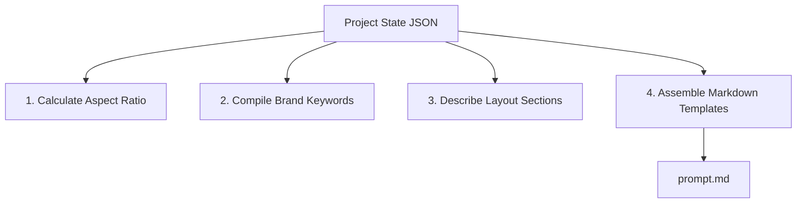
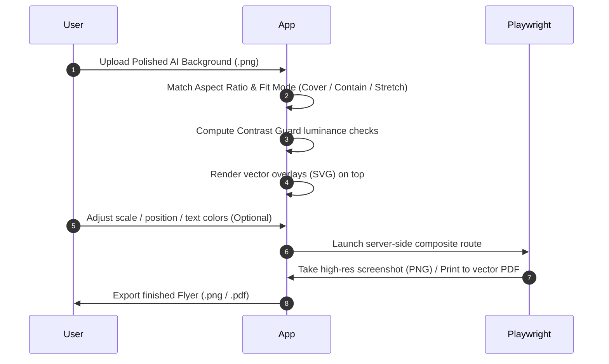

# Export & AI Handoff Design Review

This document establishes the architecture, data models, file structures, and algorithms for the Export Package and AI Handoff workflow in the Template-to-Flyer Generator (AdGen).

The core product principle of AdGen is separating **content truth** (text, prices, logos, QR codes) from **visual styling** (colors, backgrounds, textures, layout polish). This design ensures that text details are preserved perfectly while allowing AI image generators to polish the design.

---

## 1. Export Package File Structure

The export package is generated as a single, compressed ZIP file containing all visual, textual, and layout data required by both the human user and AI tools.

```text
handoff-package_[timestamp].zip
├── README.md                           # User walkthrough & execution steps
├── prompt.md                           # Dynamic visual prompt instructions for AI
├── negative-prompt.txt                 # Tokens/terms to suppress text & noise
├── assets/                             # Image assets used in the flyer layout
│   ├── brand_logo.png                  # Cropped & sized logo asset
│   ├── item_001_thumb.jpg              # Focal-cropped image for item 1
│   └── item_002_thumb.jpg              # Focal-cropped image for item 2
├── metadata/                           # JSON structures for programmatic tools
│   ├── project.json                    # Complete dump of project state (for re-import)
│   ├── content.json                    # Raw item and text data (content truth)
│   ├── layout.json                     # Computed coordinate boxes & font guidelines
│   └── brand.json                      # Brand configuration (colors, keywords, fonts)
└── renders/                            # High-resolution visual layout references
    ├── rough-layout.png                # Reference render containing all text & elements
    ├── rough-layout-background-only.png# Reference layout with text removed (critical)
    ├── exact-text-overlay.svg          # Deterministic vector overlay (transparent bg)
    └── exact-text-overlay.png          # High-resolution raster transparent overlay
```

### File Specification Details

| File Name                                  | Format     | Purpose / Description                                                                                                           |
| :----------------------------------------- | :--------- | :------------------------------------------------------------------------------------------------------------------------------ |
| `README.md`                                | Markdown   | Provides steps on how to copy prompt templates, load the rough layout as a reference image, generate the polish, and re-import. |
| `prompt.md`                                | Markdown   | Dynamic visual styling directions custom-tailored for Midjourney, DALL-E, and Stable Diffusion.                                 |
| `negative-prompt.txt`                      | Plain Text | Comma-separated negative prompting tokens focused on removing text, letters, and artifacts.                                     |
| `metadata/project.json`                    | JSON       | The standard AdGen export format conforming to the `Project` schema. Enables full state recovery on import.                     |
| `renders/rough-layout.png`                 | PNG        | Raster layout preview. Ideal as a ControlNet Canny/Scribble reference or Midjourney image reference.                            |
| `renders/rough-layout-background-only.png` | PNG        | Complete card layout with identical dimensions, colors, and product photos, but **all text, badges, and logos omitted**.        |
| `renders/exact-text-overlay.svg`           | SVG        | Clean, vector text layer preserving native font rendering and geometries for exact layout compositing.                          |
| `renders/exact-text-overlay.png`           | PNG        | Transparent raster text layer aligned exactly to target pixel bounds (e.g., 3300x5100 px for letter flyer) for quick overlays.  |

---

## 2. Prompt Template Strategy

To generate relevant styling, `lib/export/promptBuilder.ts` compiles the brand profiles, style keywords, canvas aspect ratios, and spatial card layout into text files.

### Prompt Compilation Pipeline



### Prompt Construction Formula

1. **Aspect Ratio Formatter**: Reads `canvas.widthPx` and `canvas.heightPx` and outputs aspect ratio tags:
   - For Midjourney: `--ar W:H` (simplifying coordinates e.g., 3300x5100 -> `11:17`).
   - For Stable Diffusion/DALL-E: explicit dimensions in pixels.
2. **Brand Style Compilation**: Concatenates `brand.styleKeywords` (e.g., `"tactical, premium, dark industrial, orange accents"`) into a clean styling prompt.
3. **Dynamic Layout Description**: The layout engine evaluates the layout tree and appends a descriptive grid sentence:
   - _Example_: `"The layout is structured as an inventory board with a prominent header block at the top, a footer block at the bottom, and a 3-column grid containing 12 distinct product panels."`
4. **AI-Safe Layout Zones**: Appends specific instructions for zones defined as `ai_instruction_zone` (e.g., `"Keep the footer block as a dark solid background for high-contrast overlays."`).
5. **Format-Specific Directives**:
   - **Midjourney Prompt**:
     `[URL to rough-layout.png] a professional, styled background template for an inventory board, [styleKeywords], clean card frames, dark textured background, high contrast --ar [aspect_ratio] --stylize 250 --v 6.0`
   - **Stable Diffusion (ControlNet)**: Instructs the user to set the preprocessor to `canny` or `scribble` using `rough-layout.png` to preserve structural container boundaries.
   - **DALL-E 3 (ChatGPT)**: A verbose paragraph outlining the spatial composition, design elements, and a strict requirement to leave card contents blank.

---

## 3. Overlay Strategy & Text Preservation

The overlay strategy secures exact rendering of product text, prices, and branding elements onto the AI-polished background image.

### Step-by-Step Composition Workflow



### 1. Import Alignment Math

AI generators frequently shift canvas sizes or aspect ratios slightly (e.g., DALL-E 3 rounds canvas sizes, or Midjourney adjusts aspect ratios).
The editor UI provides fit modes:

- **Stretch**: Scaled to 100% of canvas width and height.
- **Cover (Default)**: Scales background to fill canvas, cropping excess.
- **Contain**: Scales background to show entirely, padding letterbox areas.
- **Manual Offset & Scale controls**: The user can adjust background scale ($S$) and translate ($X, Y$) to align visual frames with the deterministic text grid.

### 2. Contrast Guard & Legibility Assistance

To prevent text from blending into bright or noisy AI-generated backgrounds, the system executes real-time contrast checks:

- **Luminance Extraction**: The app samples background pixels under the bounding box $(x, y, w, h)$ of each text element.
- **Relative Luminance Calculation**:
  $$L = 0.2126 \cdot R + 0.7152 \cdot G + 0.0722 \cdot B$$
- **Contrast Ratio Assertion**: Computes ratio ($CR$) between text color and background luminance. If $CR < 4.5:1$ (or $3:1$ for headers), the system triggers a warning:
  `[Warning] Text element [id] has low contrast (CR: 2.1:1). Readability risk.`
- **Mitigation Tools**:
  - **Backing Panels**: Toggle a solid or semi-transparent background plate behind the text block (e.g., black backing with 60% opacity).
  - **Drop Shadows**: Apply standard CSS/SVG filter drop shadows (`feDropShadow`) to outline text shapes.
  - **Stroke Outline**: Render text with a vector stroke border (e.g., `#000000` text with `1.5px` `#FFFFFF` stroke).

### 3. Vector Preservation in Exports

- **PNG Exports**: Renders background and SVG overlay inside Playwright, taking a raster screenshot at target pixel scale.
- **PDF Exports**: Playwright prints the page to a PDF document. By maintaining the overlay as clean inline SVG text, **the text remains selectable, sharp, and vector-perfect inside the PDF**, bypassing raster blur.

---

## 4. Risks Around AI Text Corruption & Mitigation

### Why AI Image Generators Corrupt Text

1. **Lack of Character-Level Tokenization**: Vision-Language models capture visual representations semantically rather than character-by-character.
2. **Diffusion Noise Denoising Limits**: Text has high spatial frequency and requires sharp, pixel-perfect edge transitions. Diffusion processes tend to round out letters, turning characters into illegible swirls.
3. **The "Double-Texting" Trap**: If the AI generator is given a layout containing visible text characters (e.g., "$530"), it will try to reconstruct that text, resulting in deformed letters on the polished image. When the app overlays the clean vector text, the deformed AI characters will peek out from behind, creating an ugly double-image or ghosting effect.

### Critical Mitigations

> [!IMPORTANT]
> To eliminate ghosting, the AI handoff package must isolate structural elements from text.

- **Background-Only Reference (`rough-layout-background-only.png`)**:
  This file must be rendered by omitting all character paths. Text zones are represented as solid/empty visual blocks matching the background card colors. Product images remain, but all prices, labels, titles, and disclaimers are removed.
- **Strict Negative Prompting**:
  `negative-prompt.txt` should contain specific, heavy-weight negative tokens:
  `text, letters, words, spelling, writing, font, typography, logo, brand, signature, watermark, numbers, price tags, digits`.
- **Text-Free System Prompt**:
  `prompt.md` includes the instructions:
  - `"Do not generate any text, words, labels, or numbers."`
  - `"Leave all card containers and header blocks clean and empty of written characters."`
  - `"Focus entirely on background textures, panel border styles, lighting, and layout polish."`

---

## 5. MVP Acceptance Tests

To verify that handoffs and overlays function correctly, the following tests must be implemented:

### 1. Unit Tests (Vitest)

- **`Prompt Generation Test`**:
  Asserts that `lib/export/promptBuilder.ts` compiles brand keywords, projects, aspect ratios, and negative prompts into markdown without null errors or missing fields.
- **`Background-Only Filter Test`**:
  Asserts that rendering in background-only mode removes all visual text components. Verify that no SVG `<text>` elements exist in the generated asset structure.

### 2. Integration / Snapshot Tests

- **`Layout-to-Overlay Coordinate Match Test`**:
  Generates an overlay SVG and layout JSON. Assert that the bounding box coordinates inside `layout.json` match the SVG layout coordinates exactly.
- **`Playwright Rendering Accuracy Test`**:
  GIVEN a mock layout with an imported background image, WHEN rendering via Playwright, THEN confirm the output matches target canvas aspect ratios and captures transparent overlay assets correctly.

### 3. Manual QA Checklist

- [ ] **ZIP File Integrity**: Extract a generated package and verify the existence of all 10 core files (`README.md`, `prompt.md`, `negative-prompt.txt`, assets, metadata JSON files, and renders).
- [ ] **Ghost-Text Prevention Verification**: Load the generated `rough-layout-background-only.png` in an image viewer and confirm that no visible letters, prices, or logo texts are rendered.
- [ ] **Contrast Guard Interactive Check**: Insert a white text card over a light gray background. Confirm that the editor displays a visual warning in the validation panel. Verify that enabling a "Backing Panel" resolves the warning.
- [ ] **High-Resolution Vector Verification**: Export the flyer as a PDF. Open the PDF, zoom in to 600%, and verify that the text remains vector-sharp and searchable.

---

## 6. Proposed Code Modules & Directory Layout

To build this capability cleanly within the Next.js and Tailwind stack, the following modules must be created:

```text
lib/export/
├── promptBuilder.ts      # Generates prompt.md and negative-prompt.txt from Project schema
├── overlayRenderer.ts    # Generates transparent SVG/PNG containing text truth, QR codes, logos
├── backgroundRenderer.ts # Generates the layout layout visual representation with all text omitted
├── zipPackager.ts        # Bundles assets, metadata JSON, prompts, and renders into a ZIP
└── compositingEngine.ts  # Background image sizing, fit logic, scale-translation matrices
app/api/export/
├── zip/
│   └── route.ts          # Endpoint to fetch and stream the handoff ZIP package
└── composite/
    └── route.ts          # Playwright route to composite background + overlay to PDF/PNG
```
