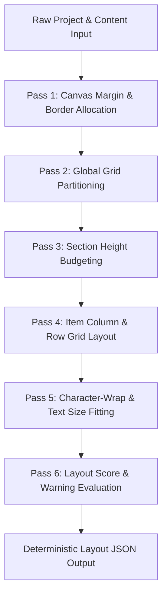

# Layout Engine & Renderer Review

_Design and Architecture Specification for the AdGen Layout System_

This document outlines the deterministic layout engine and rendering architecture for the Template-to-Flyer Generator. It establishes the mathematical heuristics, component structures, rendering pipelines, test cases, and failsafe modes required to achieve consistent, high-fidelity flyer generation.

---

## 1. Recommended Layout Algorithm: Hierarchical Grid Partitioning (HGP)

To ensure strict determinism, testability, and fast execution, we recommend the **Hierarchical Grid Partitioning (HGP)** algorithm. It operates as a multi-pass math solver in pure TypeScript, with no dependency on browser DOM or layout engines.



### Pass 1: Canvas Margin & Border Allocation

1. Retrieve canvas pixel boundaries $W_{canvas}$ and $H_{canvas}$ along with the safe margin $M_{safe}$ from `CanvasPreset`.
2. Compute the active printable boundaries:
   $$W_{active} = W_{canvas} - 2 \cdot M_{safe}$$
   $$H_{active} = H_{canvas} - 2 \cdot M_{safe}$$

### Pass 2: Global Area Partitioning

The canvas is vertically partitioned into three absolute blocks:

1. **Header Block**: $H_{header} = \text{clamp}(0.08 \cdot H_{active}, \text{MinHeader}, \text{MaxHeader})$
2. **Footer Block**: $H_{footer} = \text{clamp}(0.06 \cdot H_{active}, \text{MinFooter}, \text{MaxFooter})$
3. **Main Content Block**: $H_{content} = H_{active} - H_{header} - H_{footer}$

### Pass 3: Section Height Budgeting

Each section $S_i$ is allocated a target height budget based on its priority weight and the count of items it contains.

1. Assign priority coefficients:
   $$
   P(S_i) = \begin{cases}
   1.5 & \text{if priority is } \text{"high"} \\
   1.0 & \text{if priority is } \text{"normal"} \\
   0.6 & \text{if priority is } \text{"low"}
   \end{cases}
   $$
2. Calculate the raw section weight:
   $$\text{Weight}(S_i) = P(S_i) \cdot \sqrt{\text{itemCount}(S_i)}$$
3. Compute height allocated to section $S_i$:
   $$H(S_i) = H_{content} \cdot \frac{\text{Weight}(S_i)}{\sum_j \text{Weight}(S_j)}$$

### Pass 4: Item Column & Row Grid Layout

Within the allocated section height $H(S_i)$, we calculate row and column configurations based on the selected density setting ($D \in \{ \text{"loose"}, \text{"normal"}, \text{"dense"} \}$) and total items $N_i$:

1. Determine Column Count $C_i$:
   - For **loose**: $C_i = \max\left(1, \lfloor 0.7 \cdot \sqrt{N_i} \rfloor\right)$
   - For **normal**: $C_i = \max\left(1, \lfloor 1.1 \cdot \sqrt{N_i} \rfloor\right)$
   - For **dense**: $C_i = \max\left(2, \lfloor 1.5 \cdot \sqrt{N_i} \rfloor\right)$
2. Compute Row Count $R_i = \lceil N_i / C_i \rceil$.
3. Distribute height inside the section:
   - Account for section title block $H_{sec\_title} \approx 40\text{px}$.
   - Available item height: $H_{sec\_content} = H(S_i) - H_{sec\_title}$.
   - Compute individual item bounds:
     $$W_{item} = \frac{W_{active} - (C_i - 1) \cdot Gutter_x}{C_i}$$
     $$H_{item} = \frac{H_{sec\_content} - (R_i - 1) \cdot Gutter_y}{R_i}$$
   - Calculate absolute $(X, Y, W, H)$ coordinates for each item cell.

### Pass 5: Character-Wrap & Text Size Fitting

Since Node cannot query DOM elements, we use a character-width estimation table to calculate text flow:

1. Establish standard font width-to-height aspect ratio factor (e.g., $F_{width} \approx 0.55$ for typical sans-serif headings).
2. For an available text container box of size $(W_{box}, H_{box})$ and font size $S_{font}$:
   - Number of characters per line $C_{line} = \lfloor W_{box} / (S_{font} \cdot F_{width}) \rfloor$.
   - Split string into lines based on word-wrapping logic at $C_{line}$ characters.
   - Total estimated height $H_{est} = \text{lineCount} \cdot (S_{font} \cdot \text{lineHeightFactor})$.
3. **Iterative Reduction**: If $H_{est} > H_{box}$, decrement $S_{font}$ by $0.5\text{px}$ and recompute until $H_{est} \le H_{box}$ or $S_{font} < 10\text{px}$.
4. If $S_{font}$ drops below $10\text{px}$ (8pt), truncate text with an ellipsis (`...`) and raise the `text_overflow` warning flag.

### Pass 6: Layout Scoring Function

A layout score is calculated out of 100 points, serving as a heuristic metric to choose between generated layout variants.
$$\text{Score} = 100 - \sum \text{Penalties}$$

| Penalty Category           | Mathematical Formula / Condition                                             | Value | Rationale                                                     |
| :------------------------- | :--------------------------------------------------------------------------- | :---- | :------------------------------------------------------------ |
| **Text Overflow**          | For each item card triggering `text_overflow` flag.                          | -30   | Text truncation breaks flyer readability.                     |
| **Tiny Font Size**         | For each text element scaled below $10\text{px}$ threshold.                  | -20   | Prevents legal text or prices from becoming unreadable.       |
| **Unbalanced White Space** | If unoccupied space ratio $U_{ratio} > 0.3$ or $U_{ratio} < 0.05$.           | -15   | Loose layouts feel empty; overcrowded layouts feel cluttered. |
| **Grid Aspect Mismatch**   | If card aspect ratio $W_{item}/H_{item} > 2.5$ or $< 0.4$.                   | -15   | Prevents distorted images or heavily squeezed cards.          |
| **Hero Prominence**        | If Hero items are not at least $1.5\times$ larger in area than normal items. | -10   | Ensures visual hierarchy matches intent.                      |
| **Missing Image Box**      | If item has image asset but the card has zero image area.                    | -5    | Ensures product photos are not suppressed.                    |

---

## 2. Renderer Architecture

The Template-to-Flyer Generator splits layout styling into structured, deterministic stages to prevent the common AI image generation trap of hallucinated text.

```text
                  +----------------------------------+
                  |    Zustand Store / Project JSON  |
                  +----------------------------------+
                                   |
                                   v
                  +----------------------------------+
                  |      Deterministic Layout Engine |
                  +----------------------------------+
                                   |
                    Produces coordinates (X, Y, W, H)
                                   |
                                   v
                  +----------------------------------+
                  |         React Canvas UI          |
                  +----------------------------------+
                                   |
           +-----------------------+-----------------------+
           |                                               |
           v                                               v
+-------------------------+                     +-------------------------+
|  Background-Only Canvas |                     |   Text-Only SVG Overlay |
|  - Layout grids, borders|                     |   - Titles, subtitles   |
|  - Cropped product photos|                     |   - Prices, badges      |
|  - Solid background colors|                    |   - Disclaimers, QR codes|
+-------------------------+                     +-------------------------+
           |                                               |
     Playwright PNG                                  Playwright SVG
           |                                               |
           v                                               |
+-------------------------+                                |
|   AI Image Generator    |                                |
|   (Midjourney / ChatGPT)|                                |
|   - Polish visual style |                                |
|   - Preserve structure  |                                |
+-------------------------+                                |
           |                                               |
  Polished Background image                                |
           |                                               |
           +-----------------------+-----------------------+
                                   |
                                   v
                  +----------------------------------+
                  |        Final Compositor          |
                  | - Superimpose exact text SVG     |
                  +----------------------------------+
                                   |
                                   v
                  +----------------------------------+
                  |     High-Resolution PNG / PDF    |
                  +----------------------------------+
```

### Components List

1. **`CanvasPreview`**: Renders standard React components inside the editor. Uses CSS absolute positioning backed by the computed coordinate tree.
2. **`BackgroundRenderer`**: Implements a dedicated rendering path. Sets all text tags (`h1`, `p`, `span`, etc.) to `display: none` or transparent, rendering only the layout boxes, product images, shapes, and background fills.
3. **`OverlayRenderer`**: Implements the opposite rendering path. Emits an inline vector `<svg>` container. Coordinates from the layout engine map to absolute `<text>` nodes, path-based `<svg>` badges, and vector QR codes, while images and grid container cards are hidden.
4. **`FinalCompositor`**: Orchestrates the combination of the AI-polished background asset and the transparent SVG vector overlay. The backend loads these layers into an HTML viewport and captures a print-resolution output via Playwright.

---

## 3. Test Cases & Layout Configurations

The table below outlines how the layout engine behaves across varying item counts, explaining card selections, column allocations, and expected fallback mechanics.

| Item Count | Recommended Layout Family | Layout Structure & Grid Math                                                                                                     | Card Variants & Image Fit                                                                                            | Expected Whitespace & Density                                                                               | Failsafe / Overcrowd Mitigation                                                                                                               |
| :--------: | :------------------------ | :------------------------------------------------------------------------------------------------------------------------------- | :------------------------------------------------------------------------------------------------------------------- | :---------------------------------------------------------------------------------------------------------- | :-------------------------------------------------------------------------------------------------------------------------------------------- |
|   **1**    | **Premium Single-Item**   | Header, footer, single large card taking up $100\%$ width and $70\%$ content height.                                             | **wide** / **hero** variant. Image fits with `contain` mode on the left; text/CTA block sits on the right.           | Loose density ($40\%$ padding). Extra whitespace framing the central hero.                                  | None required. Scale font sizes to maximum readable size ($>48\text{px}$ title).                                                              |
|   **2**    | **Split Feature Layout**  | $2$ horizontal split rows ($1$ column $\times$ $2$ rows) or $2$ side-by-side vertical columns ($2$ columns $\times$ $1$ row).    | **wide** or **normal** variant. Horizontal split uses image-left text-right.                                         | Loose-to-normal density ($25\%$ padding). Symmetric, high-contrast layouts.                                 | Font auto-scales down to $16\text{px}$ minimum if title lengths exceed column width.                                                          |
|   **5**    | **Hero + Grid Flyer**     | $1$ Hero item at top ($100\%$ width, $45\%$ content height). Remaining $4$ supporting items packed into a $2\times2$ grid below. | Hero card uses **wide** (cover image); supporting cards use **normal** (image-top text-bottom).                      | Normal density. Standard gutters ($30\text{px}$ horizontal, $40\text{px}$ vertical).                        | If grid items have long descriptions, the solver automatically hides the descriptions, keeping only Title and Price.                          |
|   **12**   | **Sectioned Grid**        | Grouped by $3$ sections ($4$ items per section). Rendered in a $3$-column $\times$ $4$-row global grid.                          | **normal** card variant. Square crop ($1:1$ ratio) image fit.                                                        | Normal-to-dense density. Gutters reduced to $20\text{px}$ to preserve margin rules.                         | Sections are kept together. If a section splits unevenly, the solver balances columns (e.g. $2\times2$ instead of $3\times1$).                |
|   **20**   | **Dense Inventory Board** | $4$ sections ($5$ items per section). Rendered in a $4$-column grid.                                                             | **compact** card variant. Image is minimized to small left thumbnail; text is limited to Title, Subtitle, and Price. | Dense density ($5\%$ padding). Gutters set to $10\text{px}$. Safe margins restricted to minimum boundaries. | Descriptions are hidden. Prices are aligned to bottom-right of the thumbnail strip. Truncation active if title $>35$ chars.                   |
|   **30**   | **Compressed Catalog**    | $5$ sections ($6$ items per section). Packed in a $4$-column grid or list format.                                                | **compact_row** variant. All product images are hidden. Each item is a single text-and-price row.                    | Extreme density. Very narrow margins. Section headers are thin separator lines.                             | Auto-switches layout to text-only list mode. Truncation active for titles. Warning `canvas_overcrowded` is flagged to suggest PDF page split. |

---

## 4. Failure Modes & Mitigations

To deliver a commercial-grade application, the layout engine and renderer must handle edge cases gracefully:

### A. Text Overflow / Line Wrapping

- **Risk**: User enters a long description that overflows the product card, drawing text over pricing elements or borders.
- **Mitigation**:
  1. The layout engine enforces absolute boundaries. If font decrementing reaches $10\text{px}$ and the height still exceeds the boundary, text-truncation is enforced using CSS `line-clamp` or substring slicing.
  2. Flag a validation warning in the property panel: `"Text in [Item Name] truncated to fit boundaries"`.

### B. Canvas Overcrowding (Item Bloat)

- **Risk**: User imports $50$ items via CSV and requests a letter-sized flyer, resulting in microscopic text ($<6\text{px}$) and overlapping elements.
- **Mitigation**:
  1. Define a hard minimum height/width for cards (e.g., $120\text{px}\times60\text{px}$).
  2. If the grid solver calculation outputs items smaller than this limit, the solver halts layout generation, falls back to rendering a scrollable list, and triggers a critical warning: `"Layout blocked: too many items to fit on a single canvas page."`
  3. Recommend action: `"Switch canvas preset to 11x17 Poster, reduce item count, or toggle off images."`

### C. Low-Contrast Brand Colors

- **Risk**: Brand profile defines a white background with yellow text, rendering the text overlay unreadable on export.
- **Mitigation**:
  1. Perform a real-time contrast check in `lib/validation/rules.ts` using the WCAG 2.0 relative luminance formula.
  2. If contrast ratio falls below $4.5:1$ (AA standard for body text), highlight the color inputs and present a recommendation: `"Low contrast detected. We recommend selecting a darker primary color or adding a dark backing panel behind text overlay."`

### D. Multi-Aspect Ratio Image Chaos

- **Risk**: Product photos consist of vertical phone snaps, square crops, and wide landscape banners, disrupting grid symmetry.
- **Mitigation**:
  1. Standardize item cards to crop all images using a target aspect ratio constraint (e.g., $4:3$ or $1:1$ placeholders).
  2. Apply `sharp` on the backend to enforce the crop relative to the user-defined focal point, and utilize `object-fit: cover` or `object-fit: contain` inside the renderer depending on layout hints.

### E. Playwright Screenshot Engine Timeouts

- **Risk**: Headless browser export crashes or hangs due to external images taking too long to load, resulting in incomplete exports or empty image boxes.
- **Mitigation**:
  1. Implement base64 data URL inline conversion for all images during the export step, removing the need for external network requests inside the Playwright browser.
  2. Enforce a strict $5$-second screenshot timeout on the server side, returning a diagnostic error if rendering hangs.

---

## 5. Directory Map & Module Responsibilities

We recommend organizing the layout files under these specific, decoupled modules:

```text
c:/Software/AdGen/
├── lib/
│   ├── layout/
│   │   ├── solver.ts         # Deterministic layout calculations & coordinate generation
│   │   └── textFit.ts        # String length estimation, line-wrapping, font scaling
│   └── validation/
│       └── rules.ts          # Contrast checking, overcrowding, and validation scoring
├── components/
│   └── canvas/
│       ├── CanvasPreview.tsx # React editor absolute placement layer
│       ├── Background.tsx    # Renders layout shapes and images only
│       └── TextOverlay.tsx   # Renders transparent SVG vector overlays
└── app/
    └── api/
        └── export/
            └── route.ts      # Server-side Playwright ZIP export handler
```
