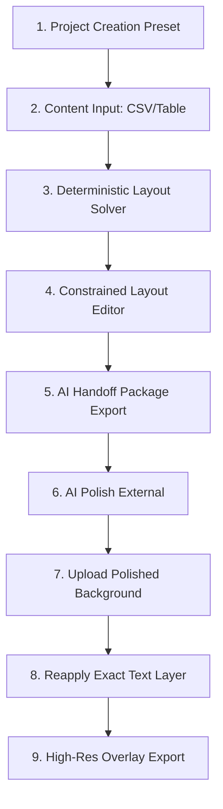

# Product / UX Workflow Review & Specification (v0.1 & MVP)

This document defines the Minimum Viable Product (MVP) user workflow, screens, risks, and prototype acceptance criteria for the Template-to-Flyer Generator (`AdGen`).

---

## 1. Core UX Principle: Content-Driven Compiler First, Editor Second

To avoid the trap of becoming a generic, complex Canva or Photoshop clone, the application enforces a strict separation of **content truth** from **visual style**.

The workflow is structured as a **Flyer Compiler**:

1. The user inputs raw structured data (Content Truth).
2. The deterministic layout engine solves element positioning mathematically.
3. The editor restricts visual changes to layout configuration (columns, spacing, density, content priorities) rather than freeform vector placement.
4. The AI generator polishes the visual texture, and the app overlays the exact content back on top.



---

## 2. Recommended MVP Screens

The MVP will consist of **four core user interfaces**. Below are the specifications and layout diagrams for each screen.

### Screen 1: Dashboard & Project Setup

The starting point for a user. It focuses on project organization, brand profiles, and creating new flyers.

- **Key Controls**:
  - **Recent Projects Grid**: Cards showing project name, format, date, and thumbnails of the rough/final layouts.
  - **"Create New Flyer" Button**: Launches the Setup wizard.
  - **Brand Profiles Tab**: Dedicated manager for brand assets (logos, colors, contact block details, default footers).
- **"Create Project" Wizard Modal**:
  - _Step 1_: Project Details (Name, Brand Profile selector).
  - _Step 2_: Canvas Preset Picker (Letter Flyer 8.5"x11", Poster 11"x17", Instagram Square, Custom).
  - _Step 3_: Layout Family Preset (Inventory Board, Hero + Grid, Menu/Listing).
  - _Step 4_: Text Overlay Enforcement (Enabled by default).

### Screen 2: Project Workspace (Dual-Mode Interface)

This is the primary editor. It is split into two views to keep the user focused on the active task: content organization vs. visual layout adjustments.

```
+-----------------------------------------------------------------------------+
| Top Toolbar: [Dashboard] Project Name | Undo [ ] Redo [ ] | [View: Content | Canvas]  [AI Handoff] |
+-----------------------------------------------------------------------------+
|                                                                             |
|  [MODE A: Content Table View]                                               |
|  +-------------------------------------+---------------------------------+  |
|  | Actions: [Import CSV] [Add Section] | Section: Compact (Order: 1)     |  |
|  | +---------------------------------++---------------------------------+ |  |
|  | | = Section 1: Compact Carry      || Item Name      | Price | Priority| |  |
|  | | = Section 2: Range / Training   || Smith & Wesson | $530  | normal  | |  |
|  | | = Section 3: Premium Handguns   || Sig Sauer P322 | $400  | normal  | |  |
|  | +---------------------------------++---------------------------------+ |  |
|  +-------------------------------------+---------------------------------+  |
|                                                                             |
|  [MODE B: Layout Canvas View]                                               |
|  +--------------+---------------------------------------+----------------+  |
|  | Left Sidebar | Center: Canvas Preview                | Right Sidebar  |  |
|  |--------------|                                       |----------------|  |
|  | Brand Style  | +-----------------------------------+ | Card Editor    |  |
|  | Layout Fam   | |   [ CFC TACTICAL INVENTORY BOARD ]| | Title: [...]   |  |
|  | Density [==] | |  +------------+  +---------------+  | | Price: $530  |  |
|  |              | |  | Item 1     |  | Item 2        |  | | Crop: [Cropt]|  |
|  | Layout Score | |  | [Photo]    |  | [Photo]       |  | | Fit: contain |  |
|  |   [ 92% ]    | |  | $530       |  | $400          |  | | Priority:    |  |
|  | Warnings:    | |  +------------+  +---------------+  | | ( ) Hero     |  |
|  | - Text fit   | |                                   | | (*) Normal   |  |
|  |              | +-----------------------------------+ | ( ) Compact  |  |
|  +--------------+---------------------------------------+----------------+  |
+-----------------------------------------------------------------------------+
```

- **Mode A: Content Table View**:
  - _UX Detail_: Spreadsheet-like interface. Allows bulk CSV upload or clipboard pasting.
  - _Interactions_: Drag-and-drop rows (via `@dnd-kit`) to reorder items within or between sections. Focus is purely on text, badges, prices, and photo uploads.
- **Mode B: Layout Canvas View**:
  - _UX Detail_: Central preview rendering the SVG/HTML layout.
  - _Left Sidebar_: Controls for the layout engine (e.g. swap layout family, adjust density slider, toggle canvas preset, live layout score, validation logs).
  - _Right Properties Inspector_: Opens when clicking a card or section in the canvas. Allows setting crop boundaries, focal point, image fit mode (`contain`, `cover`, `transparent`), and toggle priority status.
  - _Bottom Variant Picker_: Displays thumbnails of 3 alternative layouts computed by the engine from the same content data. Clicking a thumbnail applies it instantly.

### Screen 3: AI Handoff & Export Interface

Prepares the handoff bundle. It visually demonstrates to the user what the AI will see versus what the app will overlay.

- **Key Panels**:
  - **Visual Structure Pane**: Previews `rough-layout.png` and `rough-layout-background-only.png` (where text coordinates are filled with solid neutral color blocks).
  - **Prompt Workspace**: Shows the generated visual instruction markdown. Allows manual copy or refinement.
  - **Export Actions**: One-click download of the ZIP package.
- **Prompt Configuration Panel**: Allows user to select target generator (e.g. Midjourney, DALL-E 3) to adapt prompt guidelines and formatting.

### Screen 4: Final Overlay Compositor

The post-AI step where user brings the polished background image back to the app to re-apply pristine text layers.

- **Key Panels**:
  - **Background Upload Dropzone**: Accepts the AI-generated PNG/JPG.
  - **Canvas Compositor**: Renders the AI image as the background, layering the exact SVG/HTML text and vector blocks on top.
  - **Overlay Adjustment Inspector (Right)**:
    - _Contrast Tools_: Apply drop-shadows, semi-transparent card background plates (with opacity sliders), text strokes, or invert text colors.
    - _Nudge Panel_: Global offset adjustment (X, Y) to align the entire text block, plus individual section nudging (to account for minor AI-generated layout shifts).
  - **Export Button**: Render and compile high-resolution final PNG or print-ready PDF (via headless browser engine).

---

## 3. Non-MVP Exclusions (Scope Constraints)

To launch the prototype rapidly and maintain the content-driven compiler focus, the following features are **strictly out of scope**:

1.  **Freeform Element Placement**: Users cannot click and drag text boxes or images to arbitrary pixel coordinates on the canvas. Element positioning is calculated by the layout engine.
2.  **In-App Image Generation API**: No direct API integration (such as Midjourney or DALL-E endpoints) in v0.1. Generation is handled by the user in external AI tool tabs.
3.  **Arbitrary Shape Drawing**: No rectangle tools, circle tools, or vector brush paths.
4.  **Real-Time Collaborative Editing**: Single-user client workspace.
5.  **Multi-page Compilations**: The workspace is limited to single-page layouts (flyer, poster, social post). Multi-page catalogs are deferred.
6.  **Advanced Vector Background Removal**: basic rectangular crop and focal-point alignment only.

---

## 4. Key UX Risks, Traps & Mitigations

| Risk / Trap                      | Description                                                                                                                                         | Mitigation Strategy                                                                                                                                                                                                                                     |
| :------------------------------- | :-------------------------------------------------------------------------------------------------------------------------------------------------- | :------------------------------------------------------------------------------------------------------------------------------------------------------------------------------------------------------------------------------------------------------ |
| **The Canva Clone Pitfall**      | User attempts to treat the canvas as a freeform editor, requesting typical graphics-suite features, which bloats code and slows layout compilation. | **Constraint-first UI**: Eliminate drawing tools. Restrict canvas modifications to swapping cards, section orders, and adjusting card priorities. Explain this clearly in tooltips.                                                                     |
| **AI Background Distortion**     | The external AI generator shifts card panels or headers relative to the original rough layout, rendering the deterministic text overlay misaligned. | **1. Background-only Export**: Mask text zones with gray boxes to enforce container shapes to the AI. <br>**2. Overlay Nudging**: Provide X/Y nudging per section/group in Screen 4 so users can easily realign blocks over distorted background cards. |
| **Contrast & Text Readability**  | AI-generated backgrounds have complex lighting, gradients, or textures that make thin overlay text illegible.                                       | **Overlay Enhancement Kit**: Include built-in outline (stroke), drop-shadow, and backing card plate presets. Provide a real-time contrast checker indicating readability score.                                                                         |
| **Data Overflow (Overcrowding)** | User loads a CSV containing 30 items onto an Instagram Square canvas, causing text overlapping, shrinkage, or truncations.                          | **Deterministic Safety Solver**: Calculate a "Layout Score" based on minimum font-size and overflow checks. Display warnings and lock exports if the score falls below a critical threshold.                                                            |
| **CSV Parsing Failures**         | Small business owners upload CSVs with bad column headings, empty rows, or encoding errors.                                                         | **Import Wizard Mapping**: Include a step-by-step table mapping user columns (e.g. "Pistol Model") to AdGen schema keys ("Title").                                                                                                                      |

---

## 5. Core Workflow Walkthrough (User Experience Steps)

1.  **Project Start**:
    - User opens the app, clicks "New Project", inputs "Tactical Handgun flyer" and chooses "Poster 11x17" preset, selecting "Inventory Board" family.
2.  **Content Import**:
    - User uploads `handguns.csv` or pastes rows directly from Excel.
    - The app populates the tabular Content table view. User assigns images to the items.
3.  **Layout Reflow**:
    - User switches to the "Canvas View". The app has automatically grouped items into categories, positioned card boundaries, and sized images based on normal/featured density rules.
    - User clicks the "Make Denser" slider or switches between Variant A (2-column section grid) and Variant B (3-column layout) until satisfied.
4.  **Visual Refinement**:
    - User clicks the premium handgun card and checks "Hero" priority. The layout engine recalculates the layout instantly: the premium handgun is expanded to a large hero card spanning the full row width, shifting other cards down.
5.  **Export Handoff Package**:
    - User clicks "Export for AI Polish". The app generates a structured ZIP file containing the visual templates, visual-safe backgrounds, layout instructions, and prompt.
6.  **AI Image Generation (External)**:
    - User copies the generated prompt text from `prompt.md` and uploads `rough-layout.png` alongside it into Midjourney. The AI outputs a visually stunning, textured background aligning to the template.
7.  **Overlay & Finalize**:
    - User downloads the AI image and uploads it into Screen 4 of AdGen.
    - The app overlays pristine fonts, prices, and QR codes. The user applies a dark drop-shadow to the white text for readability and exports the final PDF proof.

---

## 6. Acceptance Criteria for the First Usable Prototype (v0.1 / Phase 0-1)

To verify the viability of the layout engine and compositing workflow, the first prototype must satisfy the following criteria:

- [ ] **Model Integrity**: Can parse a project JSON matching the schema outlined in `docs/SCHEMA_PLAN.md` and load section/item trees correctly.
- [ ] **Deterministic Compilation**: The layout engine calculates and outputs explicit, non-overlapping bounding coordinates `(x, y, w, h)` for a test set of 12 items grouped into 3 sections.
- [ ] **Layout Reflow**: Modifying an item's priority state from `normal` to `hero` automatically shifts surrounding boxes without manual intervention or coordinate collisions.
- [ ] **Export Package Creation**: Clicking export produces a valid ZIP containing `rough-layout.png` (complete skeleton), `rough-layout-background-only.png` (background blocks without text), and `prompt.md` (markdown instruction text).
- [ ] **Fidelity Compositing Proof**: Uploading a background image and applying the transparent overlay text SVG/HTML layers produces a combined composite export where vector text maintains exact alignments and sharp text boundaries at 300 DPI.

---

## 7. Recommended Project Modules & Files

For clean execution by subagents, the following project structure is recommended:

- `docs/subagents/product_ux_review.md`: This specification file (UX guidelines).
- `lib/layout/solver.ts`: Pure layout engine computing bounding boxes.
- `lib/layout/textFit.ts`: Heuristic font sizing and overflow calculator.
- `lib/validation/rules.ts`: Real-time warning checks (tiny text, missing legal, overflow).
- `components/canvas/RoughCanvas.tsx`: Render preview component using SVG/HTML.
- `components/canvas/OverlayCanvas.tsx`: Clean text rendering layer for compositing.
- `app/api/export/route.ts`: Playwright-based screenshot renderer.
- `app/api/handoff/route.ts`: ZIP archiver packager.

---

## 8. Test Recommendations (Fidelity & Alignment Validation)

To ensure the deterministic compiler does not break layout boundaries:

1.  **Layout Constraint Tests**: Run unit tests on the `lib/layout/solver.ts` with item counts of 1, 6, 12, and 24. Assert that no elements overlap and all items are contained within the canvas safe margins.
2.  **Overflow Boundary Testing**: Pass an item description with more than 500 characters. Assert that `lib/layout/textFit.ts` triggers a text overflow warning.
3.  **Low-DPI Warning Checks**: Test image uploads. Verify that image assets below 150 DPI emit an image quality warning.
4.  **Alignment Snapshot Test**: Maintain a static mock project (e.g. `cfc-tactical-golden`). Generate the rough layout SVG and run snapshot tests (Vitest) to check for coordinate drift during code iterations.
