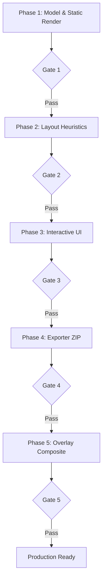

# QA and Production Readiness Review

This document defines the comprehensive quality assurance (QA) strategy, testing stack, quality gates, risk mitigation plans, and CI configuration for the Template-to-Flyer Generator (AdGen).

---

## 1. Recommended Test Stack

To maintain an MVP-first mindset while securing absolute correctness for the layout engine and output generation, we recommend the following tool stack:

| Tier                         | Tool / Library                                                                                             | Purpose                                                                | Rationale                                                                       |
| :--------------------------- | :--------------------------------------------------------------------------------------------------------- | :--------------------------------------------------------------------- | :------------------------------------------------------------------------------ |
| **Unit Testing**             | [Vitest](https://vitest.dev/)                                                                              | Pure logic, helper validation, CSV parsing, layout calculation.        | Sub-second test runs, native TypeScript support, Jest-compatible API.           |
| **Snapshot Testing**         | Vitest Snapshots                                                                                           | Layout tree coordinates (`layout.json`) and raw SVG/HTML layouts.      | Catches unexpected changes in deterministic canvas positioning instantly.       |
| **Visual Regression**        | [Playwright Test](https://playwright.dev/)                                                                 | Comparing actual browser screenshots against "golden" baseline images. | Headless browser execution matches the actual backend export renderer.          |
| **Static Verification**      | `tsc` + [ESLint](https://eslint.org/)                                                                      | Typecheck and syntax/linting rules.                                    | Ensures build safety and uniform styling.                                       |
| **Accessibility / Contrast** | [@axe-core/playwright](https://www.npmjs.com/package/@axe-core/playwright) + custom Canvas contrast checks | Programmatic compliance and accessibility auditing.                    | Ensures high-contrast readability of overlay text on user-supplied backgrounds. |
| **Security Validation**      | [file-type](https://www.npmjs.com/package/file-type) + [Sharp](https://sharp.pixelplumbing.com/)           | Uploaded asset inspection and sanitization.                            | Guards backend from malicious uploads and normalizes print density.             |

---

## 2. Focus Areas & Implementation Guidelines

### A. Unit Testing

Unit tests must verify pure modules in isolation under `lib/`. No DOM, no database connections.

- **Target Files/Modules**:
  - `lib/utils/csv.ts`: Test parsing with normal, malformed, quoted-comma, and missing-header rows.
  - `lib/utils/format.ts`: Test currency conversion, decimal formatting, and string overrides.
  - `lib/layout/textFit.ts`: Test character-width approximation and overflow prediction formulas.
  - `lib/validation/rules.ts`: Test bounds checking (tiny text, too many items, low-res warnings, missing CTA).
- **Key Requirement**: Minimum coverage of **85% statement coverage** on these files.

### B. Layout Snapshot Testing

Layout snapshots prevent regressions in coordinate calculation.

- **Test Strategy**: Run the layout engine with standard mock projects and serialize the resulting elements array (`layout.elements`) or the inline SVG output.
- **Target Cases**:
  1. Single-item hero Flyer (Verify huge card dimensions).
  2. Featured Row with 3 items (Verify equal column widths).
  3. Catalog Grid with 12 items (Verify even vertical spacing and sections).
  4. Dense Inventory Board with 24 items (Verify multi-column wrapping).
  5. Fallback Cases: Empty titles or descriptions should fall back to placeholders and not throw.

### C. Visual Regression Approach

Visual regressions must match what Playwright captures on the backend to what the user sees.

- **Pixel Tolerance**: Set max pixel threshold variation to `0.1%` and `maxDiffPixels` to 50 pixels to account for minor sub-pixel font rendering differences across CI agents.
- **DPI/Aspect Ratio**: Test presets like `Letter Flyer` (8.5x11in @ 300DPI) to ensure elements render within the safe margins (`safeMarginPx`).

### D. Export Tests

The backend ZIP exporter compiles several pieces. Tests must check the ZIP structure and file integrity.

- **Verification Logic**:
  - Unpack the generated `.zip` buffer in-memory.
  - Assert existence of `rough-layout.png`, `rough-layout-background-only.png`, `exact-text-overlay.svg`, `prompt.md`, `negative-prompt.txt`, and `project.json`.
  - Validate that `project.json` matches the root schema and parses correctly.
  - Verify asset images in the zip are cropped matching the user's focal-point specifications.

### E. Sample Project (End-to-End) Tests

Use the database seed data ("CFC Tactical" Handgun Inventory Board) as a continuous integration benchmark.

- **Pipeline**:
  1. Load seed project into the SQLite test database.
  2. Call Layout Engine Solver -> Verify layout score is calculated and above 80.
  3. Simulate "Export for AI Polish" API call -> Retrieve zip file.
  4. Upload mock polished background -> Apply exact overlays.
  5. Render Final Composite -> Assert output matches expected size dimensions.

### F. Accessibility & Readability Checks

Since the app overlays vector text on top of an arbitrary AI-generated image, readability is the primary hazard.

- **Contrast Safeguard**: Programmatically analyze the overlay text color (from `BrandProfile.colors.primary` / `secondary` / `muted`) against the calculated background area color.
  - _Recommendation_: If the user imports a dark AI background but the overlay text is also dark, issue a high-severity readability warning in the editor.
  - _Accessibility Check_: Ensure the UI maintains a minimum contrast ratio of **4.5:1** for normal text and **3.0:1** for large text (WCAG 2.1 Level AA) using a color distance heuristic or canvas pixel analysis of the bounding box.
- **Font Size Safeguards**: Enforce a minimum font size of `10px` / `8pt` for screen-printed/physical flyers, and `12px` for digital web banners.

### G. Security Basics for Uploaded Assets

To prevent malicious file execution or denial of service:

1. **Magic Number Check**: Do not trust the file extension (e.g. `.png`). Read the file's magic bytes (using `file-type` library) to verify it is a valid PNG, JPG, or SVG.
2. **Path Traversal Protection**: Sanitize filenames prior to writing to the filesystem. Remove relative paths (`../`, `..\\`) and special characters. Use UUIDs or hashes for storage filenames.
3. **Sharp Processing (Sanitization)**: Pass every uploaded image through Sharp. Strip metadata (EXIF/GPS data) to ensure privacy, and enforce a maximum width/height (e.g., 4096px) to avoid decompression bombs.

### H. File Size and Image-Resolution Warnings

Ensure physical print files look sharp, not pixelated.

- **DPI Math**:
  $$\text{DPI} = \frac{\text{Pixel Dimension (width or height)}}{\text{Target Physical Dimension in inches}}$$
  - _Example_: An image that is 600px wide, placed on a card that prints at 4 inches wide has a DPI of $600 / 4 = 150\text{ DPI}$.
- **Thresholds**:
  - **< 150 DPI**: Severe Warning (Image will look extremely blurry or pixelated in print).
  - **150 - 299 DPI**: Moderate Warning (Acceptable for web/digital, sub-optimal for high-quality print).
  - **>= 300 DPI**: Optimal (Perfect print quality).
- **File Size Warnings**: Warn the user if individual uploads exceed 10MB (to prevent performance lag on editor canvas) or if the total project zip size exceeds 50MB.

---

## 3. Quality Gates

Before any milestone is marked complete, it must pass the specified Quality Gates.



### Phase 1: Content Model & Deterministic Renderer

- **Quality Gate Checks**:
  - Database schema passes `prisma validate`.
  - Database seed script populates 100% of "CFC Tactical" handgun items.
  - TypeScript compilation runs with zero errors (`npm run typecheck`).
  - Unit tests verify formatting utility outputs standard currency symbols.

### Phase 2: Heuristic Layout Engine

- **Quality Gate Checks**:
  - Unit tests for column choice heuristics and layout coordinate solvers pass.
  - Snapshot tests generated for 1, 6, 12, and 24 items verify exact bounding box values.
  - Validation engine test coverage is > 90%.
  - Zero TypeScript `any` types permitted in layout interfaces (must use `LayoutElement` and `Item`).

### Phase 3: Content Organizer & Visual Editor UI

- **Quality Gate Checks**:
  - UI component tests verify drag-and-drop triggers coordinate updates in Zustand.
  - Redo/undo history stack is verified to correctly restore state on canvas.
  - Screen reader accessible tags (`aria-label`) verified on sidebar tabs and property controls.
  - Visual regression testing passes for the default 3 presets (Flyer, Poster, Instagram).

### Phase 4: AI Handoff Package Exporter

- **Quality Gate Checks**:
  - Playwright screenshot tests run in headless mode inside the API route.
  - PNG output sizes exactly match the canvas preset physical dimensions at the designated DPI.
  - ZIP exporter checks assert that `prompt.md` is valid non-empty markdown, and asset folder paths are safe.

### Phase 5: Polished Image Import & Final Composite

- **Quality Gate Checks**:
  - Upload security validator blocks non-image magic numbers (e.g. renaming `.exe` to `.png`).
  - Overlay rendering is tested under varying contrasts to ensure contrast rules warning fires if threshold is not met.
  - Playwright headless exporter successfully combines background and text overlay to generate a high-res PDF.
  - Final end-to-end integration test of the handgun flyer runs, generates a file, and terminates cleanly.

---

## 4. Highest-Risk Areas and Traps

### Risk 1: Playwright Cold-Start and CI Performance

- **Problem**: Running a headless browser inside a server action or API route is resource-heavy. On cold-starts or resource-constrained CI/CD containers, Playwright can time out, causing empty exports or 504 Gateway errors.
- **Mitigation**:
  - Implement a dedicated timeout of at least 15 seconds.
  - Reuse Playwright browser instances or run a light pool.
  - Cache browser binaries in the CI pipeline cache directory to avoid downloading Chromium on every test run.

### Risk 2: Font Rendering Inconsistencies

- **Problem**: Layout coordinates are calculated deterministically on the server/client, but text width depends on browser font metrics. If a font is missing on the client machine or the CI environment, the text will fall back (e.g., to Arial or Times New Roman), causing lines to wrap unexpectedly and trigger false text overflow warnings.
- **Mitigation**:
  - Standardize on web-safe system fonts (e.g., Arial, Helvetica, system-ui) or explicitly load self-hosted web fonts (WOFF2 format) packaged in the public assets directory.
  - Include font metrics testing inside Playwright regression suites to verify text widths are identical on Windows, macOS, and Linux.

### Risk 3: Malicious File Uploads (RCE & Path Traversal)

- **Problem**: Allowing users to upload asset images and polished backgrounds can lead to security vulnerabilities. A user could upload a script disguised as an image, or use filenames like `../../../etc/passwd` to overwrite system files.
- **Mitigation**:
  - Enforce file name sanitization: replace all spaces and non-alphanumeric characters.
  - Verify mimetype using magic numbers (via `file-type`).
  - Read and write file content only via standard asset storage directories using deterministic UUID-based filenames.

---

## 5. Specific Test & Safeguard Modules to Create

To implement this strategy, the following files should be created:

| File Path                              | Description                                              | Responsibility     |
| :------------------------------------- | :------------------------------------------------------- | :----------------- |
| `__tests__/unit/csv.test.ts`           | Test CSV parser logic (empty rows, commas, quotes).      | Vitest             |
| `__tests__/unit/layout.test.ts`        | Test layout solver for 1, 6, 12, and 24 items.           | Vitest / Snapshots |
| `__tests__/unit/validation.test.ts`    | Verify validation rules (low DPI, tiny text, overflows). | Vitest             |
| `__tests__/integration/export.test.ts` | Simulate Playwright rendering and ZIP compilation.       | Playwright         |
| `lib/utils/security.ts`                | File upload type validation and path sanitization.       | Sharp / File-Type  |
| `lib/validation/contrast.ts`           | Algorithmic contrast calculator (WCAG compliance).       | Color Math         |
| `playwright.config.ts`                 | Headless browser visual regression setup.                | Playwright         |

---

## 6. Recommended CI Workflow

Create the following file in the repository to automate testing on every code push and pull request.

**File Location**: `.github/workflows/ci.yml`

```yaml
name: CI/CD Pipeline

on:
  push:
    branches: [main, dev]
  pull_request:
    branches: [main]

jobs:
  test:
    runs-on: ubuntu-latest

    steps:
      - name: Checkout Code
        uses: actions/checkout@v4

      - name: Setup Node.js
        uses: actions/setup-node@v4
        with:
          node-version: '20'
          cache: 'npm'

      - name: Install Dependencies
        run: npm ci

      - name: Lint and Format Checks
        run: |
          npm run lint
          npm run format:check

      - name: Type Check
        run: npm run typecheck

      - name: Run Unit & Snapshot Tests
        run: npm run test:unit -- --coverage

      - name: Install Playwright Browsers
        run: npx playwright install --with-deps chromium

      - name: Run Integration & Visual Tests
        run: npm run test:integration
```
